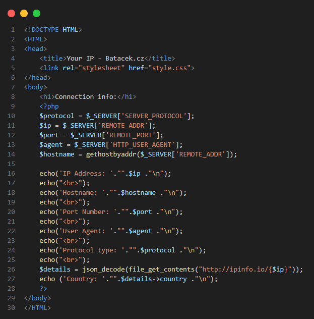
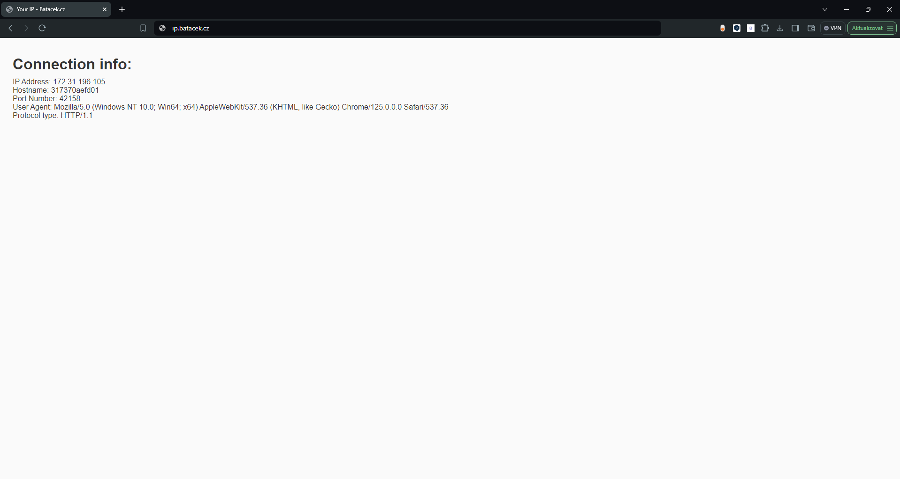

# IP Info

[](LICENSE)
[](Lang)

Get information about your IP and connection. No logs!


# Requirements

- Apache (for web server) or webhosting
- PHP (I'm using v8.1)


<h2>Step 1)</h2>
<p>Make PHP file. Just create *.php file. Index.php is typical name in this case.</p>
<h2>Step 2)</h2>
<p>Paste this code</p>

```php
<?php 

    $protocol = $_SERVER['SERVER_PROTOCOL'];
    $ip = $_SERVER['REMOTE_ADDR'];
    $port = $_SERVER['REMOTE_PORT'];
    $agent = $_SERVER['HTTP_USER_AGENT'];
    $hostname = gethostbyaddr($_SERVER['REMOTE_ADDR']);

    echo('IP Address: '."".$ip ."\n");
        echo("<br>");
    echo('Hostname: '."".$hostname ."\n");
        echo("<br>");
    echo('Port Number: '."".$port ."\n");
        echo("<br>");
    echo('User Agent: '."".$agent ."\n");
        echo("<br>");
    echo('Protocol type: '."".$protocol ."\n");
        echo("<br>");
    $details = json_decode(file_get_contents("http://ipinfo.io/{$ip}"));
    echo ('Country: '."".$details->country ."\n");
?>
```

<h2>Step 3)</h2>
<p>Run it with apache or on hosting, visit it with your browser and enjoy!</p>
<br>

